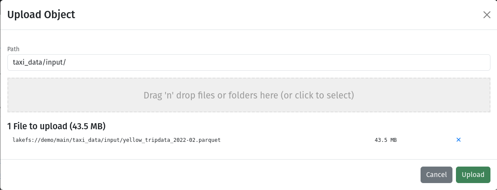

# [LakeFS](https://lakefs.io) with [Apache DataFusion](https://datafusion.apache.org) using Python


## Prerequisties

This guide assumes that you have already installed the following:

- Docker
- Docker Compose
- Python ([v3.12.3](https://www.python.org/downloads/release/python-3123/) used for development)
- `uv` ([install guide](https://github.com/astral-sh/uv?tab=readme-ov-file#getting-started))

Define a virtual environment and install requirements:

```shell
uv venv
source .venv/bin/activate
uv pip install -r requirements.txt
```

## Docker

The LakeFS service is accessible by using Docker containers. Start this service by running the following command in the terminal:

```shell
docker compose up --build
```

Confirm that LakeFS is running by opening a browser on the following website: http://localhost:8000.

## Dataset

The dataset used in this example is the NYC Taxi Trip dataset. Download the `.parquet` file from here: https://d37ci6vzurychx.cloudfront.net/trip-data/yellow_tripdata_2022-02.parquet

Once downloaded, go to the `demo` repository and upload the dataset to the following path, `taxi_data/input/`:


## Running the Application

All that remains is to `run` the application with:

```shell
python app.py
```

Once it has completed running, you will be able to see an output in the terminal window. You will also be able to find a set of files written to the following path: http://localhost:8000/repositories/demo/objects?ref=main&path=taxi_data%2Foutput%2F.
